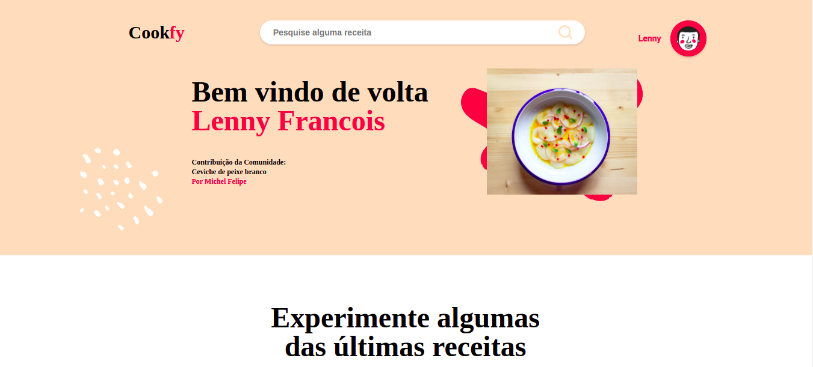
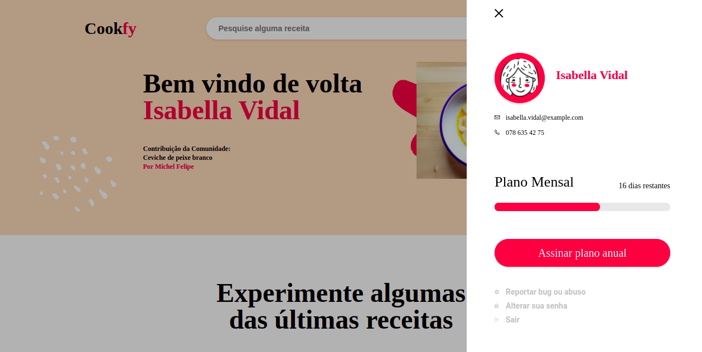

# Cookfy :cake:

 
 
 

### About Cookfy
  Project developed as a web developer challenge, by Celero.
Challenges:
- Consume an API that loads a random user data every time the page loads (name, e-mail, phone) and change the profile picture based on the gender of the user
- Follow the website mockup
- use PURE JavaScript, HTML AND CSS, without the help of frameworks and libraries
- Add animations to the components using pure JS.

  
### Tools Used
  The main framework used in building the TinDog website is JavaScript Vanilla, HTML and CSS.
  
Made with :mechanical_arm: :blue_heart: Andressa Flávia

